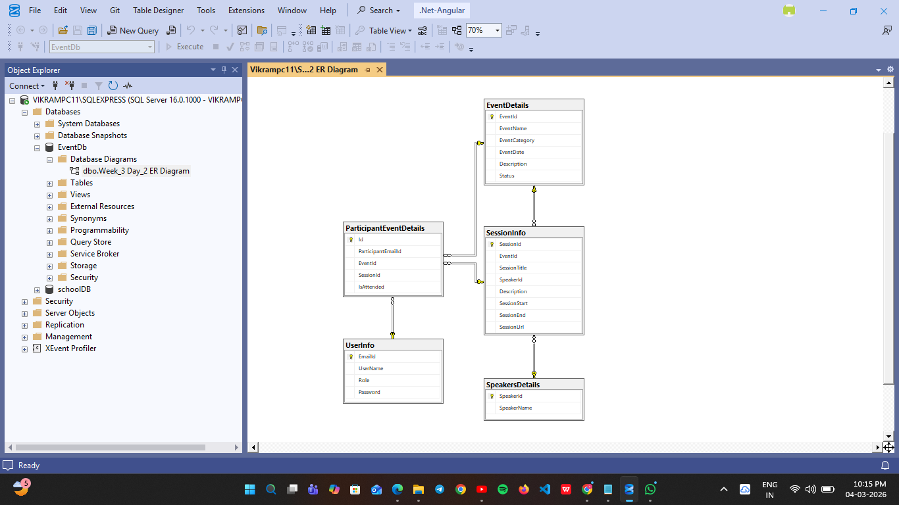

# Event Management Database (SQL Server)

## Project Description

This project contains a database design for an **Event Management System**.
The database manages events, sessions, speakers, and participants.

It was developed using **Microsoft SQL Server** and follows **ANSI SQL standards**.

---

## Database Tables

The database contains the following tables:

1. **UserInfo**

   * Stores user information (Admin or Participant)

2. **EventDetails**

   * Stores event details such as name, category, date, and status

3. **SpeakersDetails**

   * Stores information about event speakers

4. **SessionInfo**

   * Stores session details for each event

5. **ParticipantEventDetails**

   * Stores participant attendance information

---

## ER Diagram

The following diagram shows the relationships between database tables.

---

## Technologies Used

* Microsoft SQL Server
* SQL Server Management Studio (SSMS)
* ANSI SQL
* Git & GitHub

---

## How to Run This Project

1. Open **SQL Server Management Studio**
2. Open the file `EventDb.sql`
3. Execute the script
4. The database and tables will be created automatically

---

## Author

**Vikram Kurmapu**
